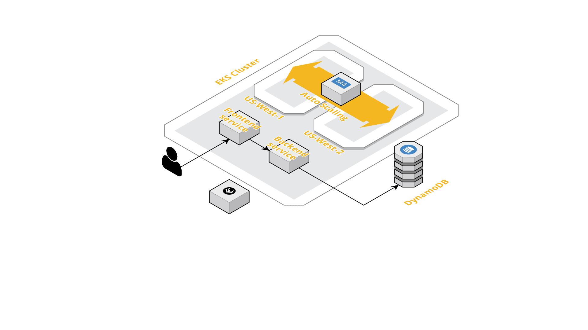

    
    
GifHub is a place to search for and store all your favorite gifs.

# App Architecture
The application consists of a React.js front-end and a Node.JS backend. Deployment of the infrastructure as well as the application is fully automated. Out of the box, the infrastructure is handled by **Terraform**. On the other hand, **Kubernetes** is being used for highly available and scalable application deployment. AWS's EKS is the base cloud platform. Although, with some modification, the application can be deployed on any infrastructure.

In its current configuration, there is an auto-scaling group of `M4.large` instances spanning across two availability zones in US-East that constitutes the worker nodes group for the Kubernetes cluster. Two services sit up front, one for each component of the application layer.

The data layer is composed solely of AWS DynamoDB. DynamoDB provides high availability, fast scalability and a fully managed DB service.

To learn more about the different components of this application, please take a look at the corresponding README files.

- [Infrastructure](./infra/README.md)
- [Backend](./backend/README.md)
- [Frontend](./frontend/README.md)