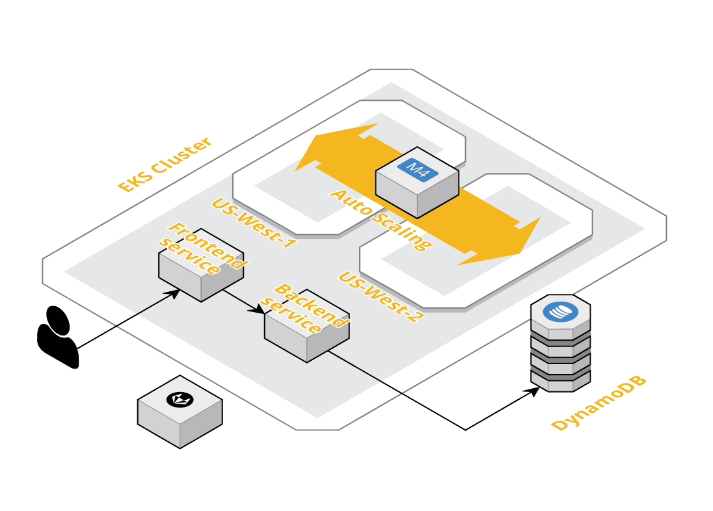

# Steps for Deployment

> Please note that these steps (and scripts) have been mainly tested on Linux. Other OS's might warrant some minor changes.

## Infrastructure

This portion will guide you through the process of bringing up the required AWS infrastructure using Terraform.

### Setting up AWS CLI
1. In AWS Console, create a new user for Terraform. e.g `gifhub_terraform`. I gave this user the following permission policies `AdministratorAccess`, `AmazonEC2FullAccess` and all of EKS related policies.
2. Install `aws-cli` by following [this guide](https://docs.aws.amazon.com/cli/latest/userguide/install-macos.html).
3. Install `aws-iam-authenticator` by following [this guide](https://docs.aws.amazon.com/eks/latest/userguide/install-aws-iam-authenticator.html).
4. Login to your account with the keys obtained in step 1 using:
```
aws configure
```
5. Create a new IAM user for programatic access of DynamoDB and download its key-pair. This user will be needed by the backend component of the application in order to read/write to the DB.

### Setting and running Terraform
1. Install Terraform by following [this guide](https://learn.hashicorp.com/terraform/getting-started/install.html).
2. Navigate to the `terraform` directory and run the `deploy_infra` shell script.

> Caution: this step might cause considerable contributions towards your AWS bill

```sh
cd ~/GifHub/infra/terraform
./deploy_infra
```
3. This shell script will perform the following steps on its own (without prompt):
```
terraform init
terraform plan
terraform apply
```

4. After bringing up the infrastructure, Terraform will produce two outputs:
- `config_map_aws_auth`
- `kubeconfig`

5. The script will automatically apply the `config_map_aws_auth`.
6. The script will also place the generated `kubeconfig` at `~/.kube/config`. Now your local `kubectl` will be pointing towards the EKS cluster. This config output is also needed to setup GitLab CI/CD.


## Application

This portion will guide you through the deployment of the application on EKS. There are a couple of ways to do this.

### GitLab CI/CD (Recommended)

In order to setup Gitlab CI/CD that runs per commit, follow these steps.

1. Fork [ahsan/GifHub](https://www.github.com/ahsan/GifHub) and mirror it on GitLab (or clone it manually).
2. In CI/CD settings of the GitLab project, populate the following variables:
```
- DOCKER_USER                   # username for your Docker account 
- DOCKER_PASS                   # password for your Docker account
- DYNAMODB_ACCESS_KEY_ID        # these are the key pair for 
- DYNAMODB_SECRET_ACCESS_KEY    # the dynamodb user created above
- KUBE_CONFIG                   # contents of ~/.kube/config
```

3. On each commit to the `master` branch, GitLab will create new images for both the components of the application, i.e backend and frontend.
4. Whenever a new tag release is pushed to the repository, GitLab will deploy the latest version of the application on EKS.


### Manually
1. Navigate to the `kubernetes` directory.
```
cd ~/GifHub/infra/kubernetes
```
1. Populate the DynamoDB variables in [local_env](./kubernetes/local_env) using the key-pair obtained in step 5 of AWS setup.

2. Run the application deployment shell script
```
./deploy_app
```
The script should perform the following steps:
- Make a backend `deployment`
- Make a frontend `deployment`
- Make a backend `service`
- Make a frontend `service`

At the end, the script will give you the ingress endpoint for the front-end service. Copy and paste it into your browser. That's it! GifHub has been deployed on your AWS EKS.